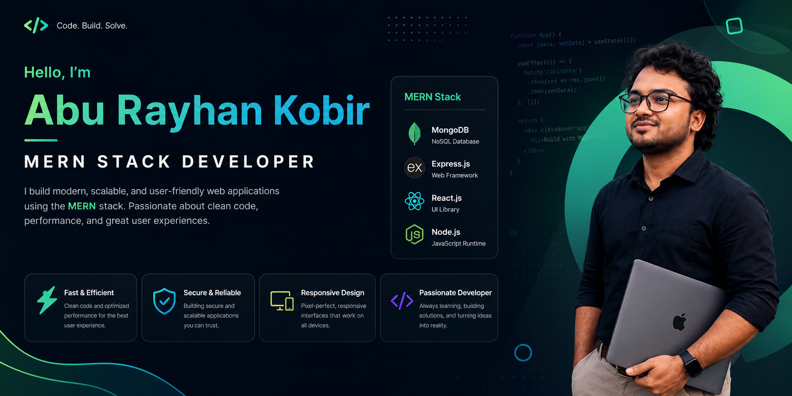

# 👋 Hello, I'm Abu Rayhan Kobir

## 🚀 Full Stack MERN Developer

<!-- Banner Image Here -->

<!-- Add your banner image link above -->

---

## 👨‍💻 About Me

I am a passionate Full Stack MERN Developer who loves building modern, scalable, and user-friendly web applications.
I enjoy solving problems, learning new technologies, and improving my skills in software development.
Currently, I am focused on building real-world projects and strengthening my backend architecture skills.

## 🛠️ Current Activities
 🌱 Exploring **Next.js** and advanced React patterns.
  
🔥 Improving my backend development skills with **Node.js, Express.js, and MongoDB**.
  
🚀 Building scalable full-stack applications using the **MERN stack**.
   
📚 Learning **TypeScript, Data Structures & Algorithms, and System Design fundamentals**.
  
💻 Working on real-world projects to improve my problem-solving skills.

# 💻 Skills & Technologies
## 🎨 Frontend Development

## ⚙️ Backend Development

## 🛠️ Tools & Platforms

## 🧰 Other Technologies

# 🚀 Featured Projects
### 🔹 Project Name 1
Short description about your project.
**Technology:** React.js | Node.js | Express.js | MongoDB

### 🔹 Project Name 2
Short description about your project.
**Technology:** Next.js | Tailwind CSS | MongoDB

# 🌐 Connect With Me

## ✨ Quote
> "First, solve the problem. Then, write the code."
⭐ Thanks for visiting my profile!
